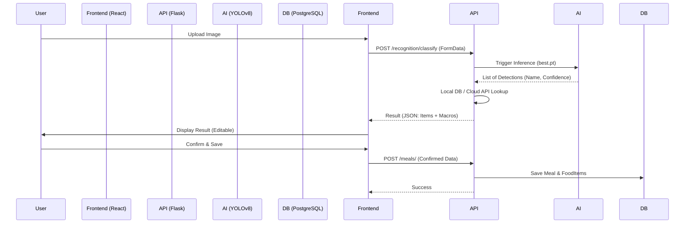

# AI Calorie Estimation Pipeline: Deep Dive

This document provides a comprehensive technical breakdown of how an image uploaded by a user is transformed into nutritional data and stored in the database.

---

## 1. High-Level Architecture
The AI integration follows a **Synchronous Recognition + Asynchronous Logging** pattern.



---

## 2. Phase 1: Frontend Capture & Request
The entry point for AI integration is the **FoodScanner**.

### UI Logic (`FoodScan.jsx`)
- **Image Handling**: Uses `URL.createObjectURL(file)` to provide an instant preview.
- **State Management**: Tracks `scanState` ('idle', 'processing', 'result', 'error').
- **Trigger**: When a file is selected, `handleFileChange` is fired.

### API Wrapper (`recognitionApi.js`)
```javascript
export const recognizeFood = async (imageFile) => {
  const formData = new FormData();
  formData.append('image', imageFile);

  const response = await axios.post(`${API_URL}/classify`, formData, {
    headers: { 'Authorization': `Bearer ${token}` },
  });
  return response.data;
};
```

---

## 3. Phase 2: Backend AI Inference
The backend processes the image using the **YOLOv8** computer vision model.

### Routing (`App/recognition/routes.py`)
- Receives the multipart form data.
- Saves the file temporarily to `uploads/scans`.
- Passes the file path to the `detector` service.

### Detection Logic (`App/core/ai/detector.py`)
The detector is implemented as a Singleton class to avoid reloading the model for every request.

```python
results = self.model(image_path) # YOLO Inference
for result in results:
    for box in result.boxes:
        conf = float(box.conf[0])
        if conf < 0.15: continue # Confidence threshold
        
        cls_id = int(box.cls[0])
        name = self.model.names[cls_id] # "pizza", "apple", etc.
```

---

## 4. Phase 3: Nutritional Analysis
Once the food item is identified by name, the system must calculate its calories, protein, carbs, and fats.

### Strategy: Hybrid Lookup
1. **Real-time API**: The system first attempts to fetch data from a cloud nutrition API (defined in `nutrition_api.py`).
2. **Local Fallback**: If the API is unavailable or the item is missing, it falls back to a curated local database in `food_database.py`.

### Local DB Snippet (`food_database.py`)
```python
FOOD_DATABASE = {
    "pizza": {"calories": 266, "protein": 11, "carbs": 33, "fats": 10},
    "apple": {"calories": 52, "protein": 0.3, "carbs": 14, "fats": 0.2},
    # ... over 50+ classes mapped
}
```

---

## 5. Phase 4: Data Persistence
The final step occurs when the user clicks **"Confirm & Save Meal"**.

### Storage Logic (`App/meals/routes.py`)
This endpoint performs three critical actions:
1. **DB Transaction**: Creates a `Meal` record and children `FoodItem` records.
2. **Image Mobility**: Moves the image from `uploads/scans` (temporary) to `uploads/meals` (permanent).
3. **Traceability**: Stores the `confidence_score` and `is_ai_detected` flag for each item to improve model training in the future.

---

## 6. Database Schema
Defined in `App/models.py`, these tables anchor the AI data.

### Meal Table
| Column | Type | Description |
| :--- | :--- | :--- |
| `id` | UUID | Primary Key |
| `name` | String | User-defined or auto-generated name |
| `total_calories` | Float | Cumulative calories of all items |
| `image_url` | String | Path to the permanent meal photo |

### FoodItem Table
| Column | Type | Description |
| :--- | :--- | :--- |
| `id` | UUID | Primary Key |
| `meal_id` | UUID | Foreign Key linking to parent Meal |
| `name` | String | The detected food name (e.g. "Steak") |
| `is_ai_detected`| Boolean| `True` if detection came from AI |
| `confidence_score`| Float | Internal confidence from YOLO (0.0 to 1.0) |

---

## 7. Configuration Details
- **AI Threshold**: 0.15 (Low threshold to capture more items, allowing user to filter).
- **Default Portion**: 100g (All calculations are normalized to 100g in the backend).
- **Model Path**: `server/server/App/core/ai/models/best.pt`.
